# Obsidia AGI — La Cognition Gouvernée

> "L'intelligence artificielle actuelle souffre d'un péché originel : l'imprévisibilité. Obsidia change de paradigme en séparant radicalement la cognition (l'IA) de la décision (le Juge)."

## 👁️ La Vision : Souveraineté par le Déterminisme

Obsidia n'est pas une simple IA, c'est une **Architecture Duale** conçue pour une intelligence souveraine, prévisible et mathématiquement prouvée. Nous croyons que l'AGI ne peut pas être une "boîte noire". Elle doit être **gouvernable**.

### Flux de Gouvernance X-108

```mermaid
graph TD
    A[Noyau Cognitif - IA] -->|Proposition| B{Espace Latent}
    B -->|Analyse de Friction| C[Agents Périphériques]
    C -->|Feedback| B
    B -->|Structure Stabilisée| D{Juge Déterministe}
    D -->|Audit X-108| E[Invariants Lean 4]
    E -->|Validation| F[Mémoire Scellée]
    E -->|Veto| G[Purge Ontologique]
    G --> B
```

### Les Piliers d'Obsidia

1.  **Séparation des Pouvoirs** : Le **Noyau Cognitif** (l'IA) explore et propose, tandis que le **Noyau Déterministe** (le Juge) valide et scelle. L'IA ne peut jamais agir sans une preuve de conformité.
2.  **Standard X-108** : Un protocole de gouvernance ex-ante qui définit les invariants mathématiques du système. Si une proposition de l'IA dévie de ces invariants, elle est instantanément bloquée.
3.  **L'Espace Latent (Sandbox)** : Un bac à sable cognitif où l'IA peut douter, tâtonner et purger ses hallucinations avant toute sortie publique.
4.  **Vérifiabilité Universelle** : Utilisation de **Lean 4** pour les preuves formelles et **TLA+** pour la validation des modèles. La confiance est une faille ; seule la preuve est une protection.

---

## 🏗️ L'Architecture en Couches

### 1. Noyau Déterministe (Le Juge)
*   **Rôle** : Valider, juger, sceller.
*   **Action** : Bloque ou autorise les flux en fonction du standard X-108.
*   **Technologie** : Invariants Lean 4 (0 sorry).

### 2. Espace Latent
*   **Rôle** : Incuber, maintenir, purger.
*   **Action** : Évalue les propositions de l'IA, retient les structures instables, purge les hallucinations.

### 3. Noyau Cognitif (IA)
*   **Rôle** : Raisonner, structurer, proposer.
*   **Action** : Synthétise, déduit, explore les solutions.

---

## 🤖 Les Agents Périphériques (L'Essaim de la Raison)

L'intelligence Obsidia naît de la friction entre des agents spécialisés :
*   **Le Douteur** : Génère une friction cognitive pour éviter les biais.
*   **L'Empathe** : Adapte la cognition au contexte humain.
*   **Le Nettoyeur** : Purge l'information avant scellement en mémoire.
*   **Le Clarificateur** : Synthétise la complexité en résultats actionnables.

---

## 📜 Le Protocole Reflex

Pour les situations exigeant une réactivité extrême, le mode **Reflex** permet de valider des patterns déjà prouvés en moins de 5ms, sans jamais sacrifier la sécurité finale garantie par le Juge.

---

## 🛠️ Explorer & Auditer

*   **Proof Lab** : Simulation en temps réel de l'interception du Juge.
*   **Livre Blanc** : Spécifications détaillées de l'architecture X-108.
*   **Preuves Formelles** : Code Lean 4 validant les invariants du noyau.

## 🚀 Accéder à l'Application

Vous pouvez explorer l'interface de gouvernance Obsidia en direct ici :
**[👉 Accéder à Obsidia AGI (Live App)](https://obsidia-agi-10791614637.us-west1.run.app/)**

---

© 2026 OBSIDIA GOVERNANCE CORE — Scellé par le Juge Déterministe.
